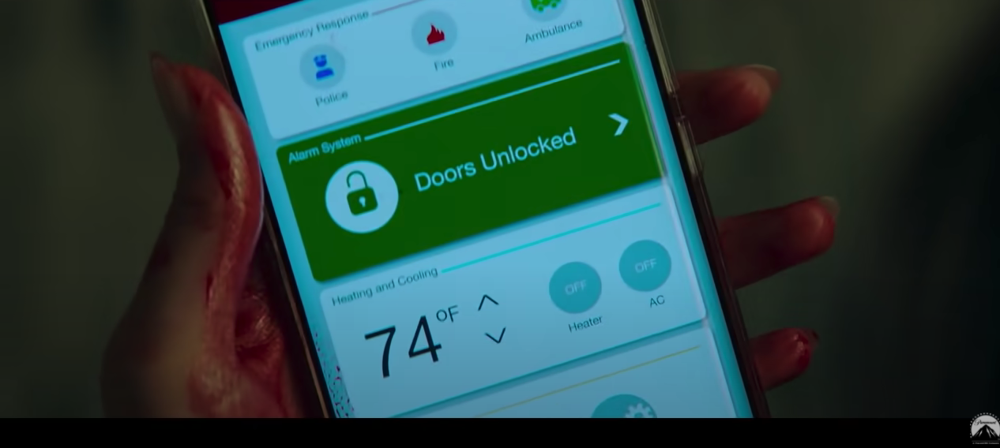
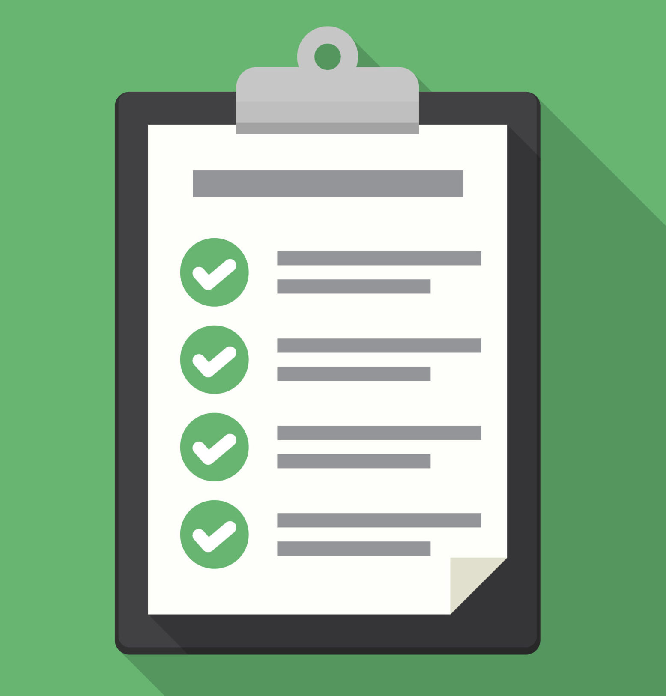
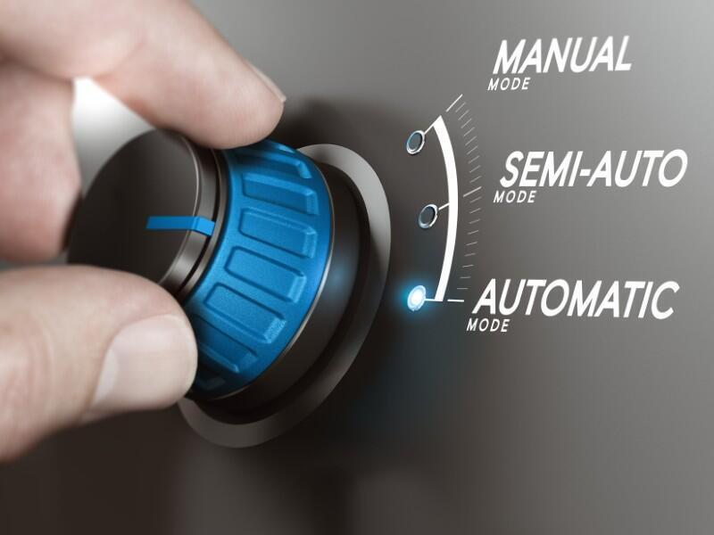
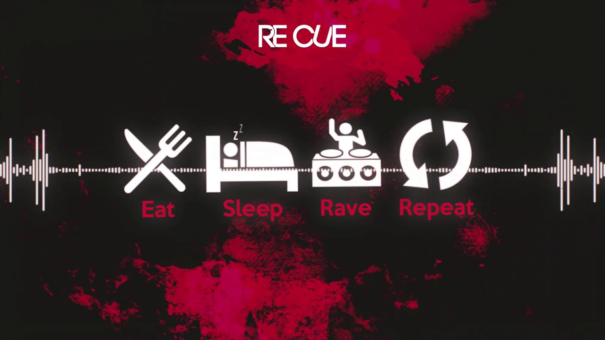

# Security Hygiene

* Update software
* Use strong authentication

<!-- .element style="box-shadow:none; position: fixed; top: 140px; right: 120px; width: 275px;" -->

<!-- .element style="box-shadow:none; position: fixed; bottom: 10px; right: 0px; width: 275px;" -->

<!-- .element style="box-shadow:none; position: fixed; bottom: 0px; right: 320px; width: 275px;" -->

<!-- .element style="box-shadow:none; position: fixed; top: 225px; left: 320px; width: 275px;" -->

<!-- .element style="box-shadow:none; position: fixed; top: 270px; left: 20px; width: 275px;" -->

<!-- .element style="box-shadow:none; position: fixed; bottom: 115px; left: 240px; width: 125px;" -->

<!-- .element style="box-shadow:none; position: fixed; bottom: 105px; left: 0px; width: 250px;" -->

<!-- .element style="box-shadow:none; position: fixed; bottom: 0px; left: 80px; width: 250px;" -->

-- Notes --

* Keep all software and devices up to date
  * Remember Zoom?
  * Dec 7: Zero-click RCE in Microsoft Teams (all versions, including web-client)
  * Also IoT devices
  * Create separate VLans for different device categories
* Also Router
  * Firmware updates
  * Strong Authentication of admin panel
  * Change default login
  * Disable wifi access to admin panel if possible
* Anything Smart
  * Smart / Electric cars
  * Including smart door locks: see Scream 2022 movie-trailer

--

# Scream 2022

"Nice Smart door locks"

<!-- .element style="vertical-align: middle; background:none; border:none; box-shadow:none; position: fixed; bottom: 20px; right: 20px; width: 830px;" -->
<!-- .element style="vertical-align: middle; background:none; border:none; box-shadow:none; position: fixed; top: 100px; right: 10px; width: 230px;" -->

--

# Plan

* Discovery
* Check
* Update
* Automate
* Repeat

<!-- .element style="vertical-align: middle; background:none; border:none; box-shadow:none; position: fixed; bottom: 20px; right: 20px; width: 430px;" -->

--

# Discovery

* What do I have?
<!-- .element style="box-shadow:none; position: fixed; width: 500px; bottom: 20px; right: 10px;" -->

-- Notes --

* Discovery
  * List all your smart devices
    * Eg. room by room
  * Walk through home:
    * Does it have Wifi / network-cable?
    * Can I connect / control through smart-app?
    * Check the manual

--

# Check

* Is it up to date?
<!-- .element style="box-shadow:none; position: fixed; width: 500px; bottom: 20px; right: 10px;" -->

-- Notes --

* Check
  * Find out need for updates
  * Can its firmware be updated?
  * Which version does it have
  * Which version is the latest (Google)
  * Add to your list

--

# Update

* Run update
<!-- .element style="box-shadow:none; position: fixed; width: 500px; bottom: 20px; right: 10px;" -->

-- Notes --

* Run an update
  * Is the menu / update process easy?
  * Google instructions (and store them digitally)
  * Contact support when needed

--

# Automate

* Enable auto updates
<!-- .element style="box-shadow:none; position: fixed; width: 500px; bottom: 20px; right: 10px;" -->

-- Notes --

* Automate
  * Enable automatic firmware updates
  * Check if it works

--

# Repeat

* Check list
* Update when needed
<!-- .element style="box-shadow:none; position: fixed; width: 500px; bottom: 20px; right: 10px;" -->

-- Notes --

* Repeat
  * Get out your list from last time
  * Check for additions
  * Google newest versions
  * Compare with current installed version
  * Update if needed
  * Check if automatic formware updates are being installed
    * Check the box

--

# Start Small

* Single room or step
* Timebox
* Plan
<!-- .element style="box-shadow:none; position: fixed; width: 500px; bottom: 20px; right: 10px;" -->

-- Notes --

Start small, either by 
* Doing one room a month or;
* Doing a step each month
* Don't recommend doing a device caterory per month:
  * Might forget / think you're done and forget not so obvious devices
* Timebox:
  * 1 or 2 hours a month, more if you like it
  * Should take less time with more complete checklists and auto-updates
* Plan:
  * Add repeating calendar item

--

# Work vs Home

* Work is work
* No device sharing
* Encrypt HDD
* Site-2-site VPN
* Master-mode:
  * VLANs
  * Security monitoring

<!-- .element style="box-shadow:none; position: fixed; top: 135px; right: 20px; width: 425px;" -->

<!-- .element style="box-shadow:none; position: fixed; bottom: 20px; left: 370px; width: 250px;" class="fragment" data-fragment-index="0" -->

<!-- .element style="box-shadow:none; position: fixed; bottom: 20px; left: 620px; width: 325px;" class="fragment" data-fragment-index="0" -->

-- Notes --

* Use your work-device for work only
