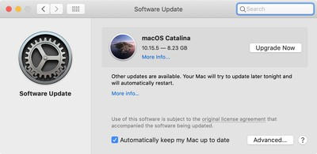

# Security Hygiene

* Update software
* Use strong authentication

<!-- .element style="box-shadow:none; position: fixed; top: 140px; right: 120px; width: 275px;" -->

<!-- .element style="box-shadow:none; position: fixed; bottom: 10px; right: 0px; width: 275px;" -->

<!-- .element style="box-shadow:none; position: fixed; bottom: 0px; right: 320px; width: 275px;" -->

<!-- .element style="box-shadow:none; position: fixed; top: 225px; left: 320px; width: 275px;" -->

<!-- .element style="box-shadow:none; position: fixed; top: 270px; left: 20px; width: 275px;" -->

<!-- .element style="box-shadow:none; position: fixed; bottom: 115px; left: 240px; width: 125px;" -->

<!-- .element style="box-shadow:none; position: fixed; bottom: 105px; left: 0px; width: 250px;" -->

<!-- .element style="box-shadow:none; position: fixed; bottom: 0px; left: 80px; width: 250px;" -->

-- Notes --

* Keep all software and devices up to date
  * Remember Zoom?
  * Dec 7: Zero-click RCE in Microsoft Teams (all versions, including web-client)
  * Also IoT devices
  * Create separate VLans for different device categories
* Also Router
  * Firmware updates
  * Strong Authentication of admin panel
  * Change default login
  * Disable wifi access to admin panel if possible

--

# Work vs Home

* Work is work
* No device sharing
* Encrypt HDD
* Site-2-site VPN
* Master-mode:
  * VLANs
  * Security monitoring

<!-- .element style="box-shadow:none; position: fixed; top: 135px; right: 20px; width: 425px;" -->

<!-- .element style="box-shadow:none; position: fixed; bottom: 20px; left: 370px; width: 250px;" class="fragment" data-fragment-index="0" -->

<!-- .element style="box-shadow:none; position: fixed; bottom: 20px; left: 620px; width: 325px;" class="fragment" data-fragment-index="0" -->

-- Notes --

* Use your work-device for work only
