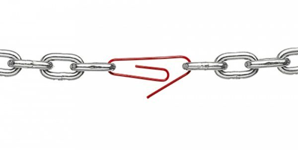
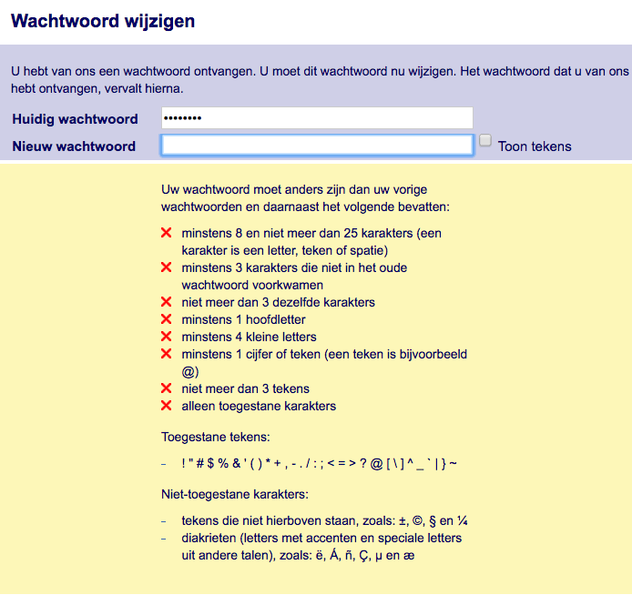
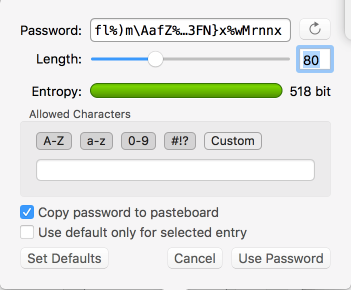

Original publishing at [First8](https://technology.first8.nl/wachtwoorden-3-mythes-4-fouten-en-5-tips-voor-gebruikers/)

# Wachtwoorden: 3 mythes, 4 fouten en 5 tips voor gebruikers

Wachtwoorden…. nog steeds het belangrijkste authenticatie mechanisme: het bewijs dat je bent wie je zegt dat je bent. 
We hebben er bovendien tientallen, zo niet honderden. Allemaal met andere eisen, andere geldigheidsduur. Ze beschermen 
(hopelijk) gegevens van vrij onbelangrijk tot zeer persoonlijk en gevoelig. We (denken te) weten wat de adviezen zijn 
voor wachtwoorden. Maar we volgen die nog steeds niet allemaal. Zijn die adviezen eigenlijk wel zo goed? Hoe kunnen we 
met al die adviezen toch op een normale manier onze gegevens veilig stellen?


Als Senior Java Developer bij First8 houd ik me tijdens en buiten werktijden bezig met security en privacy. Na te lang 
zelf gestoeid te hebben (en nog steeds) met de beperkingen van websites en applicaties op gebied van wachtwoorden, vond 
ik het tijd om een artikel te schrijven die voor eens en altijd afrekent met de mythes en valkuilen van wachtwoorden. 
Dat worden er uiteindelijk twee, gericht op gebruikers in dit artikel en ontwikkelaars in het volgende deel.

Zoals de titel al zegt, ga ik eerst een drie-tal mythes bespreken. Daarna stip ik vier fouten aan, die de meeste mensen 
nog steeds maken. Tenslotte geef ik vijf tips, die je zelf kunt toepassen om veel veiliger om te kunnen gaan met wachtwoorden 
en beveiligde accounts. Als er één advies is dat je in ieder geval wilt opvolgen, dan is dat het gebruik van een wachtwoord-manager. 
Hiermee volg je meteen een aantal zeer belangrijke tips op, die ik hieronder zal toelichten.

# Drie mythes

Om te beginnen: bepaalde adviezen van oudsher zijn achterhaald. Ze zijn gewoonweg extreem gebruikers-onvriendelijk. 
Je weet wat er dan gebeurt; we vinden een work-around. De vindingrijkheid van mensen wordt nog steeds zwaar onderschat. 
Overijverige systeembeheerders bedenken nog steeds beveiligingsmaatregelen die in de praktijk juist averechts werken.

</noscript>

## 1: Periodiek veranderen

Verander je regelmatig je wachtwoord? Waarom? Omdat het moet hè? Elk jaar, elke drie maanden of misschien zelfs elke maand. 
Wat doe je dan? Je hoogt het nummertje in je wachtwoord op met 1\. Dat is ontzettend handig als je vergeten bent wanneer 
je ook al weer in dienst kwam. Deel het getal door 4 en je hebt het aantal jaar dat je in dienst bent.

```
1. MyComplexPW1!
2. MyComplexPW2!
3. MyComplexPW3!
```

Je snapt, op deze manier is het vrij makkelijk voor een hacker om je volgende wachtwoord te raden. Bovendien: ook al zou 
je als gebruiker een compleet ander wachtwoord instellen, als je wachtwoord is gehackt of geraden, dan nog heeft een hacker 
tot maximaal 1 a 12 maanden om in je account rond te neuzen. Een verplichte periodieke wachtwoord-aanpassing heeft dus 
simpelweg geen zin.

## 2: Complexe wachtwoorden

Je wachtwoord is complex en met reden. Die reden is meestal omdat het systeem dat van je verlangt. Maar hoe goedbedoeld 
die reden ook is, de gevolgen gaan volledig aan het doel voorbij. Want wat doe je als je een wachtwoord moet bedenken 
en je wordt bestookt met allerhande moeilijke eisen? Dan ga je letters vervangen voor cijfers, leestekens etc. Alsof 
een password-hacker niet kon bedenken dat de letter A ook in de @ zit, of lijkt op een 4\. Bovendien vervangt zowat 
iedereen, niet alleen de jeugd, inmiddels de E voor een 3, de I voor een 1 of een !, de O voor de 0, etc. Het mag dan 
ook geen verrassing zijn, dat deze eisen helemaal geen toegevoegde waarde meer hebben. Als ik zeg “correct horse battery staple”, 
dan weten de meeste techies meteen waar ik op doel. Als je de comic hiernaast aanklikt, dan weet jij het vanaf nu ook. 
Overigens is ook deze theorie inmiddels achterhaald en dat heeft dan weer met dictionary attacks te maken. Het gaat iets 
te ver voor dit artikel, maar ik ga je hieronder helpen om je ook tegen deze aanval te beschermen.


## 3: Onthouden

Onthoud jij al je wachtwoorden? Nee hè? Dat dacht ik al. Dat is maar goed ook. Het is natuurlijk onbegonnen werk, met al 
die accounts die we tegenwoordig hebben. Privé-mail, werk-mail, DigiD, werk-computer, je eigen computer, verschillende 
accounts op Social media, de nodige webwinkels, natuurlijk je internet-bankieren en wat al niet meer. Langzaam maar zeker 
komt bij bedrijven het besef dat het anders moet. Social logins zoals login met je Facebook of Google account zijn een optie. 
Maar ook die brengen weer een risico. Als je Facebook account is gehackt, dan zijn alle accounts die je daaraan gekoppeld 
hebt in één keer mee gekaapt.

# Vier Fouten

Het kan vrij lastig zijn om verkeerde adviezen af te leren. Hopelijk heb ik je hierboven kunnen overtuigen hoe achterhaald 
deze rare mythes zijn. Maar het is nog veel moeilijker om de adviezen die je kent, netjes en consistent te hanteren. 
De systemen van oudsher dwingen ons in onwerkbare patronen. Zoals gezegd: dan gaan we oplossingen bedenken die het enigszins 
werkbaar maken. De bekende post-it op de monitor is daar een voorbeeld van. Maar er zijn meer “oplossingen”, die je echt 
beter kunt mijden. Hieronder geef ik aan waarom ze zo ernstig zijn en ook wat de betere oplossingen zijn.

## 1: Hergebruiken

Met zoveel accounts is het bijhouden van al die wachtwoorden praktisch onbegonnen werk. Waarom is het hergebruik van die 
wachtwoorden dan zo’n probleem? En als er eentje op straat komt te liggen, dan kan ik ze toch gewoon weer veranderen? 
Wat boeit het nou, als iemand je account van Bol.com kan inzien? Als ze iets bestellen, dan betaal je het toch gewoon 
niet? Je hebt niets te verbergen, toch? Ik [weet](https://www.youtube.com/watch?v=qIpM2bz23ak) [wel](https://www.youtube.com/watch?v=YNPI6B-BUW4) 
[zeker](https://www.youtube.com/watch?v=DLm2ATnvvGo) [dat](https://kiosk.decorrespondent.nl/products/je-hebt-wel-iets-te-verbergen-boek) 
[je](https://www.youtube.com/watch?v=T6cEwGxi9fo) [je](https://www.youtube.com/watch?v=aTuotwYkFiU) [vergist](https://www.youtube.com/watch?v=uOsjg7pvZmw).
 Maar veel belangrijker, als je overal hetzelfde wachtwoord gebruikt, dan zijn je accounts zo zwak beveiligd als de zwakste schakel. 
 Dus heeft die ene simpele katten-site het niet op orde en lekt je wachtwoord via die site uit, dan is de inlog op je 
 bankrekening ook gekaapt. Maar beveiliging kan ook bij grote bedrijven niet goed genoeg op orde zijn. Zelfs sites als 
 [LinkedIn](https://inspiredelearning.com/blog/the-linkedin-hack-understanding-why-it-was-so-easy-to-crack-the-passwords-2/), 
 [Yahoo](https://www.nytimes.com/2016/12/14/technology/yahoo-hack.html), de [ECB](http://www.cityam.com/1406190300/ecb-website-hacked) 
 en [andere](http://news.softpedia.com/news/Citi-Exposes-Details-of-150-000-Individuals-Who-Went-into-Bankruptcy-369979.shtml) 
 [banken](https://dealbook.nytimes.com/2014/10/02/jpmorgan-discovers-further-cyber-security-issues/) en 
 [financiële](https://www.consumer.ftc.gov/blog/2017/09/equifax-data-breach-what-do) [instellingen](https://www.reuters.com/article/net-us-nasdaq-cybercrime-website/nasdaq-forum-website-hacked-passwords-compromised-idUSBRE96H1F520130718) 
 worden nog steeds gehackt. Dus doe jezelf een groot plezier en gebruik je wachtwoorden slechts 1x per site.



## 2: Opschrijven

Nu de uitdaging: hoe ga je die grote wachtwoorden-brei nu werkbaar maken? Het zijn zo gigantisch veel accounts, dat alleen 
de gebruikersnaam onthouden al een uitdaging is. Dus je gaat het opschrijven. Toegeven, als je moet kiezen tussen hergebruik 
of unieke en sterke wachtwoorden die je opschrijft, dan is dat laatste nog altijd de minst erge optie. Dus mocht je niet 
handig genoeg zijn met computers, gebruik dan een [wachtwoord notitie-blok](https://www.bol.com/nl/p/wachtwoorden-notitieboek/9200000058018478/) 
en bewaak die met je leven. Maar waarschijnlijk lees je dit blog, omdat je aardig wat computer-ervaring hebt. In dat geval 
zijn er veel betere opties dan opschrijven.

## 3: Onthouden

Heb je een fotografisch geheugen? Gefeliciteerd. Maar kun je ook 100 unieke wachtwoorden met elk 60 verschillende tekens 
(inclusief leestekens) onthouden? Nee, dat dacht ik al. Daarom is mijn advies, stop met onthouden van wachtwoorden. 
Het heeft geen zin, het is onbegonnen werk en nogmaals, er is een veel betere manier.

## 4: Lengte

Hoe lang is je langste wachtwoord? Minder dan 20 tekens? Iedereen weet, hoe langer het wachtwoord, hoe moeilijker te kraken. 
Toch maken we onze wachtwoorden niet lang genoeg. Sterker nog, we kunnen het soms niet eens, al zouden we het willen. 
Hiernaast een screenshot van het wachtwoord scherm van de Belastingdienst. Kijk maar eens goed naar de draconische regels 
die je voor je kiezen krijgt. In het volgende deel voor developers zal ik hier uitgebreid op ingaan. Het belangrijkste 
punt voor nu is echter de lengte. De eerste hint geeft aan dat het wachtwoord minimaal 8 en maximaal 25 tekens mag bevatten. 
Waarom dat maximum? Er is geen enkele goede reden om de lengte van het wachtwoord te beperken tot 25 tekens. Een maximum van 
100 a 200 tekens zou veel beter zijn. Dat geeft jou als gebruiker veel betere mogelijkheden om een sterk wachtwoord te kiezen.




# Vijf tips

Voor nu even genoeg misvattingen en fouten om af moeten leren. Wat natuurlijk belangrijk is voor jou als gebruiker is hoe 
je jezelf wel goed kunt beschermen. Wat zijn nou de maatregelen die echt zin hebben? Hieronder staan vijf tips die je als 
gebruiker kunt toepassen om je accounts telkens een stuk veiliger te maken. Er is nog steeds geen 100% veiligheid, maar 
met deze maatregelen ben je als “normale” gebruiker vaak prima beschermd. Vergelijk het met de beveiliging van je huis. 
Als het heel veel moeite kost voor een inbreker om in te breken, dan zal hij al snel een ander huis kiezen. Tenzij die 
inbreker zeker weet dat er ook echt een grote buit te halen is.

## 1: Lang

Gebruik lange wachtwoorden. Zoals je in de bovenstaande strip al kon lezen, hoe langer het wachtwoord, hoe meer tijd het 
kost om het te raden. Ga voor wachtwoorden van minimaal 30 tekens. Ik zelf probeer altijd een wachtwoord van 30 tekens 
(met onderstaande maatregelen erbij) en kort dit alleen in als het moet. Zoals bij de belastingdienst dus.

## 2: Complex

Hoe complexer je wachtwoord, hoe beter. Dus gebruik alle mogelijke tekens die je kunt vinden. Wist je dat emoticons 
tegenwoordig ook officiële geldige tekens zijn? Yep, de Unicode karakter-set is nu [uitgebreid met Emoji](https://www.unicode.org/faq/emoji_dingbats.html). 
De eerste Emoji-karakters zaten daar al in sinds [2015](https://emojipedia.org/emoji-1.0/), maar sinds 
[2017](https://emojipedia.org/unicode-10.0/) kun je met gemak het complete eerste couplet van Let it go (uit de film Frozen) 
als wachtwoord invoeren.


Overigens zou ik een ander liedje kiezen. Dit couplet is namelijk al eens als wachtwoord gebruikt. Het werd uitgebreid op 
internet [besproken](https://medium.com/@hvost/why-you-should-not-use-emojis-in-your-passwords-b8db0607e169) toen de 
gebruiker [erachter](https://apple.stackexchange.com/questions/202143/i-included-emoji-in-my-password-and-now-i-cant-log-in-to-my-account-on-yosemite) 
kwam, dat hij niet meer in zijn Macbook kon inloggen.

## 3: Uniek

Het kan niet vaak genoeg gezegd worden: gebruik altijd unieke wachtwoorden. Zo beveilig je jezelf als er één van de website 
waar jij gebruik van maakt, wordt gehackt. Het uitlekken van je wachtwoord heeft dan geen sneeuwbal-effect, want de schade 
stopt bij die ene website. Het maakt niet uit, dat je dan tientallen wachtwoorden hebt. Daar hebben we de volgende tip voor.

## 4: Wachtwoord-manager

Gebruik een wachtwoord-manager. Je zult er echt even wat moeite voor moeten doen. Maar het helpt je zo ongelooflijk veel. 
Je kunt hiermee met gemak hele lange, complexe wachtwoorden instellen en bovendien voor elk account een uniek wachtwoord. 
Het is vaak zelfs mogelijk om nieuwe (unieke, lange en complexe) wachtwoorden te laten genereren, afhankelijk van de 
opties die jij aangeeft. Er is één heel belangrijke voorwaarde waar je zelf voor moet zorgen: een hoofd-wachtwoord. 
De wachtwoorden in je wachtwoord-manager worden versleuteld met dat hoofd-wachtwoord. Zonder dat wachtwoord kun je er 
dus niet in. Dat is heel goed, want dan kan een hacker er namelijk ook niet in. Let wel: er is voor dat hoofd-wachtwoord 
geen backup-optie. Er is geen “Ik ben mijn wachtwoord vergeten”-service. Onthoud dat wachtwoord dus alsof je leven ervan 
afhangt. Kies daarbij absoluut een lang en <del>moeilijk</del> niet te raden wachtwoord.



### Keuze te over

Er zijn trouwens [vele wachtwoord-managers](https://en.wikipedia.org/wiki/List_of_password_managers). Daarin zul je nog 
wat huiswerk moeten doen. Je zult een keuze moeten maken of je je wachtwoorden automatisch wilt synchroniseren via internet, 
de zogenaamde “Cloud-sync”. Daarmee kun je eenvoudig wachtwoorden die je op je thuis-computer hebt ingevoerd gebruiken 
op je werk-computer en je telefoon. Let wel: in dat geval is je hoofdwachtwoord natuurlijk super-belangrijk. Als je 
wachtwoorden-bestand wordt onderschept of gekopieerd van één van je apparaten, dan is dat hoofdwachtwoord je laatste 
verdediging voor al je accounts. Zelf gebruik ik deze functie bewust niet. Als ik de wachtwoorden wil synchroniseren, 
dan doe ik dat zelf en handmatig. Ik gebruik een USB-stick of kabeltje om het bestand over te hevelen. Hierdoor kan het 
ook niet via e-mail, wifi of LAN-netwerk onderschept worden.

### Automatisch of niet

De tweede keuze die je moet maken is of je automatische invul-functies wilt inschakelen. Er zijn voor de meeste 
wachtwoord-managers ook browser-uitbreidingen die het wachtwoord op de juiste site automatisch voor je invullen. 
Ook hierbij kies ik zelf voor wat minder gebruiksgemak, maar wel een nog betere bescherming. In dat geval moet ik 
dus om in te loggen even schakelen tussen mijn wachtwoord-manager en de browser of applicatie waar ik wil inloggen. 
Het minimale risico van een lek of misbruik in de browser-plugin sluit ik daarmee uit.

Er wordt door security-experts heel kritisch gekeken naar wachtwoord-managers en met reden. Als er een bug of lek 
ontstaat of op enig andere manier iets fout gaat bij het gebruik, dan liggen meteen al je accounts op straat. Er zijn 
dan ook nog heel wat punten waarop je je keuze voor een bepaalde wachtwoord-manager kunt baseren. Mocht je je willen 
verdiepen, dan is [hier](https://en.wikipedia.org/wiki/Password_manager) meer informatie over wachtwoord-managers. Er 
worden heel wat technische termen gebruikt. Maar als je je wilt verdiepen kun je jezelf nog beter beveiligen. Mocht dit 
te technisch worden, kies dan gerust voor een wachtwoord-manager als [1Password](https://en.wikipedia.org/wiki/1Password), 
[LastPass](https://en.wikipedia.org/wiki/LastPass) of [KeePass](https://en.wikipedia.org/wiki/KeePass).

## 5: Twee factor authenticatie

Wil je na deze tips nog meer veiligheid? Dat kan. Stel één van je wachtwoorden lekt alsnog uit, is die account dan meteen 
verloren? Dat hangt ervan af. Je gebruikt waarschijnlijk bij internet-bankieren al zo’n raar apparaatje. Dat apparaatje is 
naast je wachtwoord de tweede factor die jouw identiteit bevestigt. Het gebruik van dit soort apparaatjes of apps wordt 
2-factor authenticatie genoemd, kortweg 2FA.

Het voordeel hiervan is dat een hacker met alleen je gebruikers-naam en wachtwoord nog steeds (bijna) niets kan doen. 
Hij kan hooguit de gegevens op je rekening bekijken, maar geen geld overboekingen. Afhankelijk van hoe een website 2FA 
gebruikt, kan er dus weinig of niets misgaan. Helaas is 2FA nog lang niet overal beschikbaar. De grote websites als 
Google, Facebook, Twitter en natuurlijk banken gebruiken allemaal 2FA, optioneel of verplicht. Maak er dan ook gebruik 
van. Vaak kun je ook aanvinken dat je werkt op een vertrouwde computer, zodat je jezelf maar éénmalig of periodiek hoeft 
te identificeren met 2FA.

Gebruik ook het liefst een apparaatje, zoals banken die voor je aanleveren. Andere opties zijn autorisatie-apps, 
zoals Authy of Google Authenticator, maar ook SMS-berichten worden nog gebruikt. Die laatste is de minst veilige optie, 
aangezien ook SMS onderschept kan worden. Het is echter nog altijd veiliger dan zonder 2FA.

# Tools & 2FA dus

Er zijn dus heel wat maatregelen die je zelf kunt nemen om je accounts te beveiligen. Niet alle maatregelen zijn altijd 
toepasbaar, gezien de beperkingen van sommige websites of applicaties. Kies dus telkens de beste combinatie van maatregelen 
en probeer zoveel mogelijk opties uit. Als er iets is wat je minimaal zou moeten doen, dan is het een wachtwoord-manager 
gebruiken. Daarmee kun je meteen op een gemakkelijke manier complexe, lange en vooral unieke wachtwoorden gebruiken voor 
al je accounts. Als je waar mogelijk ook nog 2FA toepast, dan ben je eigenlijk al heel goed beschermd.

Volgende keer ga ik dieper in op de technische maatregelen die ontwikkelaars kunnen treffen om het jou als gebruiker 
makkelijk te maken en je kunnen sturen naar een veilig wachtwoord. Daarnaast zal ik ook een aantal belangrijke fouten 
toelichten, die zowel de veiligheid als de privacy van gebruikers in gevaar kunnen brengen.

[Deel 2](part2.md)