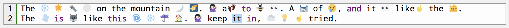

Original publishing at [First8](https://technology.first8.nl/wachtwoorden-3-mythes-4-fouten-en-5-tips-voor-ontwikkelaars-deel-2/)

# Wachtwoorden: 3 mythes, 4 fouten en 5 tips voor ontwikkelaars (deel 2)

In de vorige blogs gaf ik [hier](part1.md) al tips voor gebruikers. De mythes en fouten voor ontwikkelaars kun je 
[hier](part2.md) vinden. In dat deel heb ik overigens stiekem al enkele tips gegeven. Aan te raden is een goede combinatie 
van encoding, encryptie, hashing met salt & pepper en het gebruik van cpu en memory [hardened](https://medium.com/@mpreziuso/password-hashing-pbkdf2-scrypt-bcrypt-1ef4bb9c19b3) 
algoritmes, zoals bcrypt of scrypt. Daarnaast hintte ik al op het gebruik van bewezen frameworks zoals 
[Spring Security](https://projects.spring.io/spring-security/).

Als Senior Java Developer bij First8 houd ik me steeds meer bezig met security en privacy. Deze blog-serie is ontstaan uit 
de vraag naar praktische tips voor gebruikers en ontwikkelaars om eigen en andermans accounts veiliger te maken. Door deze 
kennis bij mezelf en mijn vakgenoten te vergroten, hoop ik de wereld veiliger te maken.

## Zoekmachine

Inmiddels is er sinds het vorige artikel heel wat gebeurd. Zo kwam Facebook uitgebreid in het nieuws door het 
[Cambridge Analytica](https://tweakers.net/nieuws/zoeken/?keyword=cambridge+analytica) schandaal. Verder kwamen er 
verschillende zoekmachines voor wachtwoorden online. De ethische variant [Gotcha.pw](https://gotcha.pw/) van Hacker 
[d0gberry](https://twitter.com/gotchapw) laat alleen een gedeelte van het mail-adres en uitsluitend de eerste tekens van 
het wachtwoord zien. Genoeg in ieder geval om te verifiëren of je in actie moet komen. En veel te weinig om er misbruik 
van te maken. Alle nieuwsmedia stonden op hun achterste benen: we moesten voordat deze zoekmachine online kwam onze 
wachtwoorden resetten. Niets is minder waar: de gegevens die d0gberry doorzoekbaar zou maken, waren zijn al jaren op 
internet ongecensureerd beschikbaar. Je loopt dus al een tijdje gevaar, mochten je gegevens erin staan. De hele hype rondom 
deze site zorgt er wel weer voor dat mensen met hun neus op de feiten worden gedrukt: het wachtwoord-probleem is serieus 
en gebruikers, maar zeker ook ontwikkelaars hebben een verantwoordelijkheid om er goed mee om te gaan.

In deze blog geef ik dan ook een aantal tips of best-practices voor account management en omgaan met wachtwoorden in 
het bijzonder, gericht op jou als ontwikkelaar. Daarbij is het belangrijkste om je gebruiker te helpen verstandige keuzes 
te maken. Beperkingen of verplichtingen bij de keuze van een wachtwoord zoals complexiteits-regels en periodiek veranderen, 
leiden vaak tot frustratie. Een wachtwoord-sterkte meter, zoals je die vaak ziet helpt wel enigszins. Deze hebben echter 
vaak een beperking, waardoor de bekende P@ssw0rd! als vrij sterk uit de bus komt. Hoe dat te verhelpen is, zal ik verderop 
in dit artikel vertellen.

# Tips

## Wachtwoord reset

De meeste mensen kennen de website [HaveIBeenPwned](https://haveibeenpwned.com/) inmiddels. Eigenaar Troy Hunt houdt je 
met deze site op de hoogte van data-lekken en dan met name login-credentials. Daarnaast houdt hij regelmatig interessante 
talks over security en de lekken die hij via zijn site inzichtelijk maakt. Daarin vertelt hij ook, dat hij vaak verzoekjes 
krijgt van ongeruste vrouwen die willen weten of hun partner een account heeft op bepaalde dubieuze sites. Dit kunnen ze 
in veel gevallen echter zelf achterhalen, zonder enige technische kennis. Een uitgelekte lijst met accounts is vaak niet 
eens nodig. De wachtwoord-reset functie is vaak genoeg om met het mail-adres van je partner te controleren of hij of zij 
er een account heeft. Het antwoord van die functie kan namelijk verschillen voor een bestaand account ten opzichte van 
een niet-bestaand account. Bekijk het onderstaande resultaat maar eens. NB: alhoewel dit probleem al lang geleden bij 
onderstaande site is aangekaart, bestaat het nog steeds.

De melding met een ongeldig mail-adres is heel anders…

… dan de melding met een bekend (geregistreerd) mail-adres

Een wachtwoord-reset functie is echter onmisbaar bij websites met account-registratie. Het goed implementeren ervan is 
nog een flinke uitdaging. Zorg er voor, dat het antwoord op eenwachtwoord-reset gelijk is, ongeacht of het mail-adres bij 
een account hoort of niet. Bijvoorbeeld Slack heeft dit goed voor elkaar:

Melding met een ongeldig mail-adres is identiek…

… dan de melding met een bekend (geregistreerd) mail-adres

Let op: voer dit ook bij het registreren van accounts door. Geef dus bij registratie geen melding dat er al een account 
bestaat bij een bepaald e-mail adres. In plaats daarvan kun je het betreffende mail-adres een waarschuwing sturen, dat iemand 
(met vermelding van IP-adres, datum en tijd, browser-gegevens en dergelijke) een nieuw account probeerde te registreren. 
Verder zou je kunnen letten op de response-tijden voor beide scenario’s. Zorg ervoor dat deze ook identiek zijn, ongeacht 
of een account bestaat of niet. Zo zorg je ervoor dat ook daarmee niet achterhaald kan worden of een mail-adres geregistreerd 
is of niet.

## All characters are equal

Heb je de blog voor gebruikers gelezen? Dan herken je dit wachtwoord ook nog wel. Dit is de songtext van “Let it go” uit 
de film Frozen, uitgeschreven als wachtwoord met Emoji’s. Ja als wachtwoord, en dit zijn allemaal geldige Unicode karakters. 
Zorg ervoor dat je deze netjes kunt inlezen bij wachtwoord invoer, wachtwoord reset en natuurlijk het inlog-scherm. 
Maar denk ook aan encoden en decoden als het wachtwoord over de lijn gaat. Zo voorkom je dat je gebruikers het wel 
kunnen instellen als wachtwoord, maar er [niet daadwerkelijk mee kunnen inloggen](https://apple.stackexchange.com/questions/202143/i-included-emoji-in-my-password-and-now-i-cant-log-in-to-my-account-on-yosemite). Controleer of er geen systemen crashen door het gebruik van speciale tekens. Het is gerechtvaardigd om [control](https://www.fileformat.info/info/unicode/category/Cc/list.htm)– en [format](http://www.fileformat.info/info/unicode/category/Cf/list.htm)– karakters uit te sluiten in een wachtwoord. De rest zou je gewoon kunnen verwerken.

## Common passwords

Met de eedergenoemde [zoekmachine voor wachtwoorden](https://gotcha.pw/) (gedeeltelijk) is eindelijk heel Nederland wakkergeschud: 
meer dan een miljard e-mail en wachtwoord combinaties zijn eenvoudig en snel doorzoekbaar. Ze lagen echter al jaren op straat. 
Daarom heeft Troy [HaveIbeenpwned](https://haveibeenpwned.com/) Hunt er een extra service bij gebouwd. Deze kan gebruikt 
worden om ge-Pwnde wachtwoorden te controleren. Je kunt er bovendien ook SHA-1 hashed wachtwoorden in testen. En sinds V2 
van [PwnedPasswords](https://haveibeenpwned.com/Passwords) kun je zelfs volstaan met alleen de eerste 5 tekens van de SHA-1 
hash. De service geeft dan een lijst van alle hashes die beginnen met deze 5 tekens. Je vraagt dus niet meer het bestaan 
van een hash van een compleet wachtwoord, maar een deel van de hash. Hiermee kun je in de kleine resultaat-set zoeken of 
de complete hash voorkomt en zo ja, hoe vaak deze in gelekte credentials voorkomen. De samenwerking van Troy Hunt met 
wachtwoord-manager [1Password](https://www.troyhunt.com/have-i-been-pwned-is-now-partnering-with-1password/) geeft gebruikers 
nu al de mogelijkheid om in de wachtwoord-manager op een veilige manier te controleren welke wachtwoorden aan vervanging 
toe zijn. En jij kunt dit ook voor jouw gebruikers doen met deze eenvoudige stappen:

1.  Hash een ingevoerd wachtwoord van je gebruiker met SHA-1\. Dit kun je doen bij het aanmaken van het account, het 
veranderen of resetten van het wachtwoord, maar ook als de gebruiker inlogt.
2.  Doe een GET-request op de Pwned Passwords API met de eerste 5 karakters van de hash: https://api.pwnedpasswords.com/range/_first5chars_
3.  Vergelijk de rest van de hash (zonder de eerste 5 karakters) met de lijst in de API response
4.  Komt de hash voor, dan is het wachtwoord ge-Pwned. Geef dit aan bij de gebruiker en adviseer deze om een ander wachtwoord te kiezen.

## E-mail adres

Vraag je bij het registratie proces naar een mail-adres? Sta dan het +-teken toe. Hieronder leg ik uit waarom.

Ken je de Gmail + hack? Stuur eens een mail naar je bestaande Gmail account, met direct voor het @-teken een +-teken gevolgd 
door een willekeurige string. Je zult de mail netjes ontvangen. Je ziet echter in het mail-adres ook de extra toevoeging. 
Gebruik dit bij het aanmaken van een account, bijvoorbeeld bij Ebay. Je gebruikt hiervoor de toevoeging 
<mijn-gmail-account>+ebay@gmail.com. Nu krijg je alle mailings van Ebay op dat herkenbare adres. Waarom is dit nuttig?

*   Je kunt nu eenvoudig filters aanmaken die alle mail _naar_ <mijn-gmail-account>+ebay@gmail.com labelen met een 
Ebay-label. Ja, dit kan ook met mail van *@ebay.com, maar je zult zien dat er ook andere mail-extensies gebruikt 
worden. Bovendien:
*   Mocht je ooit spam krijgen op adres <mijn-gmail-account>+ebay@gmail.com dan weet je dat er iets mis is gegaan. 
Ebay heeft dan een hack en/of datalek, of ze sturen zelf spam.
*   Zou je ooit in een Password-list komen met specifiek dit mail-adres, dan gaat automatische login-checks met die 
combinatie (geldig account van Ebay) niet ergens anders werken, mocht je het wachtwoord van Ebay hergebruikt hebben 
(wat je natuurlijk nooit doet). Je account bij LinkedIn is namelijk <mijn-gmail-account>+linkedin@gmail.com

Natuurlijk is dit laatste punt niet echt secure. Een beetje cybercrimineel kan deze patronen wel herkennen en 
de +-toevoeging er afhalen, dan wel aanpassen naar gelang de service waarop hij de gelekte credentials wil testen. 
Dit kost echter flink veel extra werk en vooralsnog zal dit niet snel geautomatiseerd worden. De beste beveiliging is 
natuurlijk nog altijd unieke wachtwoorden. En de +-truc werkt helaas niet overal. Daar komt onze verantwoordelijkheid 
als ontwikkelaars kijken. Zorg ervoor dat ook het +-teken ingevoerd kan worden in e-mailadressen bij registratie en 
wachtwoord reset.

## Account lockout

Als een gebruiker inlogt, lukt dit meestal in één tot drie pogingen. Als het niet lukt, kun je de gebruiker doorverwijzen 
naar de wachtwoord-reset. Maar wat doe je in de tussentijd met de login-functie? Blokkeer je deze meteen na drie pogingen? 
Dat is meteen een vrij forse maar doeltreffende maatregel. Je kunt echter een gebruiksvriendelijke en toch praktisch even 
doeltreffende maatregel toepassen. Zorg ervoor dat een gebruiker na een aantal pogingen even moet wachten, voordat hij 
weer opnieuw kan proberen. Bijvoorbeeld eerst 5 seconden wachten, daarna 10 seconden en telkens iets langer. Dit zorgt 
ervoor dat een brute-force aanval onhandig veel tijd gaat kosten en daarmee praktisch onuitvoerbaar is.

Effectief schakel je de account slechts tijdelijk uit. In eerste instantie voor enkele seconden tot misschien minuten. 
Uiteindelijk kun je ervoor kiezen de account voor bijvoorbeeld een dag uit te schakelen. Zorg er daarbij voor dat de 
gebruiker via het geregistreerde e-mail adres op de hoogte wordt gesteld van de mislukte inlog-pogingen. Dit kan 
namelijk wijzen op misbruik of hack-pogingen. Vermeld daarbij ook weer IP-adres, datum, tijd en andere gegevens die 
kunnen helpen bij het opsporen van de dader.

## HTTPS everywhere

Uiteraard laadt je het login-formulier en de login-submit alleen over https. Maar doe je dat ook met alle andere 
resources op je site? Stel, je laadt de login-pagina over https, maar enkele andere resources (wat plaatjes, een 
stukje javascript) over http. In browser-termen is dit “mixed-mode”. In dat geval kan de gebruiker er niet op vertrouwen 
dat die javascript ook echt van jou afkomt en tussentijds niet is gemanipuleerd. Bij een man-in-the-middle aanval zou 
de javascript uitgebreid kunnen worden met code die de gebruiker’s cookies doorstuurt, login-credentials steelt of 
geld-transacties doorsluist naar een bankrekening in Rusland. [Hier](https://www.youtube.com/watch?v=CSmacMZ0xZo) zie 
je een voorbeeld van een Social Security Administration site, waar deze fout kan worden misbruikt met uitleg hoe een 
hacker deze aanval kan opzetten.

Specifiek om deze reden gaan browsers steeds strenger om met mixed content. Vanaf [Chrome 68](https://security.googleblog.com/2018/02/a-secure-web-is-here-to-stay.html) en 
[Firefox 51](https://blog.mozilla.org/security/2017/01/20/communicating-the-dangers-of-non-secure-http/) worden http websites 
bovendien als “Not secure” gelabeld. Voordelen van https zijn niet alleen [security](https://www.troyhunt.com/understanding-risk-of-mixed-content/), 
maar ook [snelheid](https://www.troyhunt.com/i-wanna-go-fast-https-massive-speed-advantage/), 
[privacy](https://www.howtogeek.com/181767/htg-explains-what-is-https-and-why-should-i-care/) en zelfs 
[hogere score in Google resultaten](https://www.quora.com/What-are-the-benefits-of-HTTPS-over-HTTP). Of het moeilijk is 
of kost het geld om https te ondersteunen? [Nee](https://www.troyhunt.com/the-6-step-happy-path-to-https/), het is eenvoudig 
te automatiseren en hoeft bovendien niks te kosten. Vele redenen dus om https te ondersteunen en geen enkele reden om het 
te laten.

# Stay safe

Voor zover de blog-serie over wachtwoorden. Hopelijk heb ik je met de tips in deze serie op weg kunnen helpen naar een 
veiliger internet-gebruik voor jezelf en de gebruikers van je applicaties. De ontwikkelingen op security gebied gaan de 
laatste maanden razendsnel. Data-lekken zijn aan de orde van de dag. Met de nieuwe [GDPR](https://blog.varonis.com/gdpr-troy-hunt-explains-video-course/) / AVG regels 
die over een maand ingaan, is de noodzaak voor veilige systemen groter dan ooit. Voor vragen kun je contact opnemen via 
[Twitter](https://twitter.com/brampatelski) of [LinkedIn](https://www.linkedin.com/in/brampatelski/).
