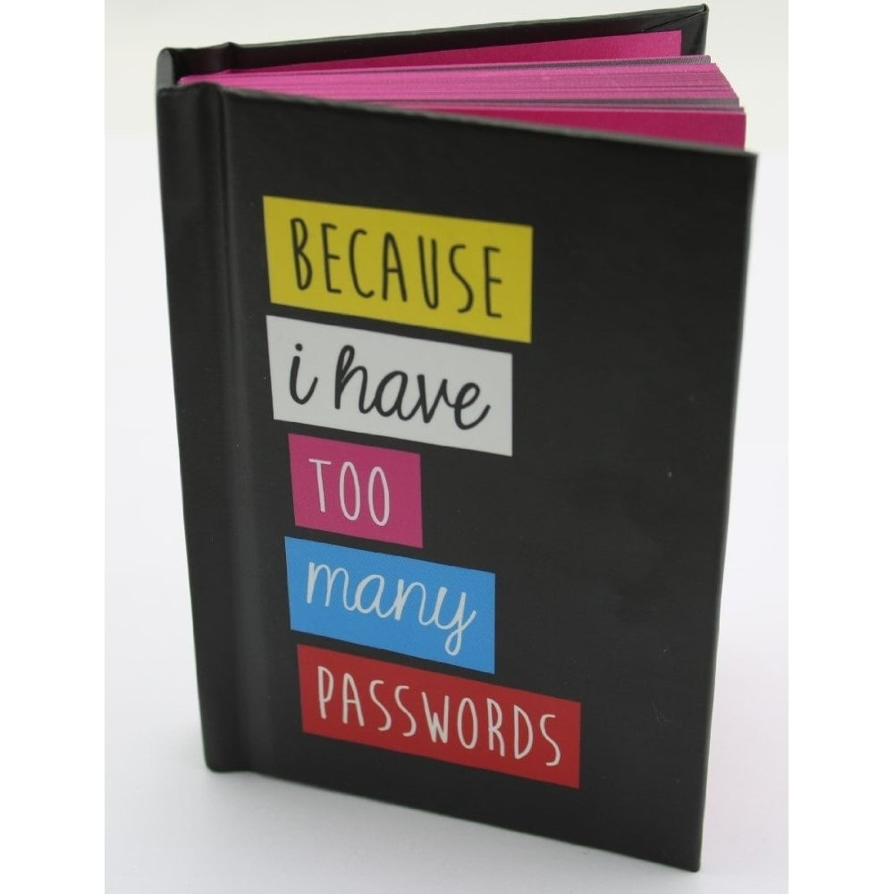

# Password managers
A password manager is a tool to store credentials for accounts:
* user-names
* passwords
* backup-keys / codes
* PGP-keys
* etc.
Password managers exist for Windows, MacOS, Linux, Android etc. 

## Single Point of Failure

"What if my password-manager gets hacked?"

Congratulations, you've just identified a security-flaw in the password-manager using strategy. You are in fact, thinking as a security-expert
specifically trying to discover attack vectors and weaknesses in security.

The most common complaint against password-managers is the single-point-of-failure argument. When storing account-credentials 
in a single tool, the user essentially puts all eggs in one basket. If the password-file is compromised, all accounts 
are essentially hacked. While this may be true, password-managers are implemented with high priority security features.
Also, a user should use password-managers with common sense rules.

Organizations implementing password-managers will have experienced crypto and security professionals working on their product
so the level of security is significantly higher than the average software company. Also, most companies have an effective 
responsible disclosure program and provide bug-bounties.

Also see [Jessy Irwin on Password managers](https://jessysaurusrex.com/2018/03/23/but-what-if-my-password-manager-gets-hacked-a-few-thoughts-on-how-to-talk-about-security-worries-with-non-experts/)

## Cracking password-managers

See [9 popular PW managers leaking secrets](https://thehackernews.com/2017/02/password-manager-apps.html). Vulnerabilities included:
* clipboard sniffing
* master-passwords stored on plain-text
* encryption keys hardcoded in application code
* auto-fill functions suceptible to phishing attacks
All without root.

Issues discovered have all been fixed in all affected password-managers prior to publication in Feb 2017.

## Master-password
The storage which contains the actual account-credentials of a password-manager is encrypted using a master-password
which the user should configure. This master-password is never stored and without it, the file is unreadable.
If an attacker has the file itself, but does not know the master-password, the attacker cannot read the file.  

Choosing a significantly hard master-password is by far the most important measure when using a password-manager

## Password-generator
Most password-managers support random password generators to help you choose significantly hard to crack passwords.
These tools are configurable with options to customize the list of characters to use, password length etc.

## Offline / Online
Some password-managers support online synchronisation among multiple devices, which can be an attack vector. Security measures are taken to prevent 
hackers from obtaining password files while synchronizing. A user can choose to disable or simply not use this function
and instead synchronize offline using either bluetooth, local wifi or cable-base file-transfer. 

## Browser forms
Most password-managers can auto-fill web-forms with your credentials. This does require the application to interface with the browser,
which could be an attack vector. Again, it is highly unlikely that this feature can be comprimized. Slim chance, but high impact.

## Non-digital
Using a password logbook is a controversial way to store passwords, as one of the first rules of password-management is "Don't write it down". 
While this is obviously very insecure for attackers having physical access to the actual notebook (burglars?) most hackers that want to 
target your accounts will rarely try to steal the notebook itself, since they would have to be physically on the same location.
Also, the risk of this happening is much smaller than a single reused password being compromized. 
So if the choice is either reusing passwords or having a notebook of unique and strong passwords, definitely use the notebook.

Use this for personal use in your house and store the notebook in a safe place, away from the computer. Preferably lock the storage location.
Do not use this for business accounts and / or on work location.

## Other conciderations
Using a password-manager on your smartphone is both a good thing and a bad thing. The way to protect your password-manager on your mobile device is the challenge.
Lots of modern smartphones come equiped with fingerprint scanners. Configuring these (and if properly stored on the device's protected storage), will increase security
beyond the simple (and shoulder-surfable) lock-patterns or codes.

BUT: your smartphone os obviously full of fingerprints. A skilled attacker [could extract and recreate a fingerprint from your phone](https://twitter.com/brampatelski/status/1010644481975246850) to unlock the device itself. Although a fingerprint
lock is sufficient to stop a thief that just wants your phone and resell it for some quick money, anyone with moderate knowledge of fingerprint-extraction and recreation could
unlock your device and access your trove of login-credentials. So to counter this attack, you could best:
* use a fingerprint-lock to lock your phone and keep out everyday smartphone thieves
* add a master-password to your password-manager on the phone instead of a fingerprint-unlock.
* always shield your typing when entering the master-password

-----------------
Links:
* [PCMag reviews](https://www.pcmag.com/article2/0,2817,2407168,00.asp)
