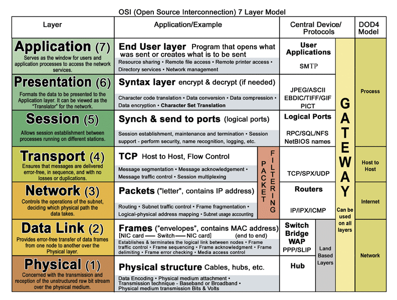

# Network layers

The OSI model consists of 7 layers, from low-level (physical) to high-level (application). 

## HUB / Switch / Router

A <b>HUB</b> (layer 1) sends any input to all (but the sending) port. In other words, all but the sending computer will receive the message.
HUBs simply transport the electricity. HUBs are dumb, simple devices.

A <b>switch</b> (layer 2 and 3) uses IP / MAC address mapping to determine which messages should be send to which computer (MAC). 

Sources:
* [Hackernoon](https://hackernoon.com/10-things-infosec-professionals-need-to-know-about-networking-d159946efc93?gi=a62f470c6a9b)
* [OSI Model for beginners](https://www.linkedin.com/pulse/osi-model-beginners-chris-roberts)
